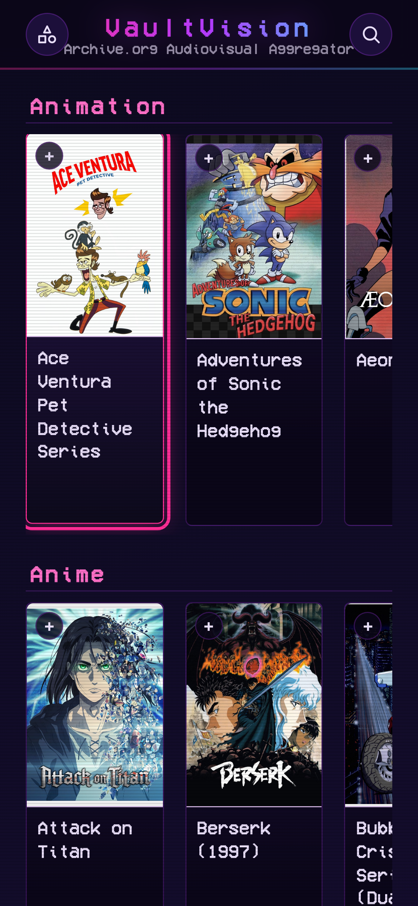
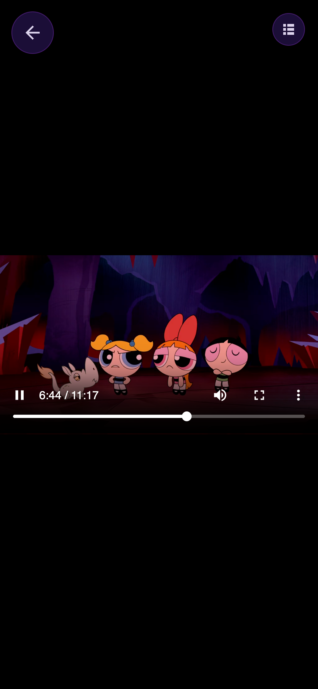

<div align="center">


# VaultVision

**A retro channel guide for classic TV, streamed straight from the Internet Archive.**

[](https://chairpants.github.io/VaultVision/)


</div>

Browse a genre-sorted guide of classic sitcoms, cartoons, anime, and drama —
**313 shows across 11 genres and growing**, added in regular batches — and
play any episode edge-to-edge straight from
[archive.org](https://archive.org). On-screen guide, episode lists, captions,
live search, favorites, a resume queue, a kids-safe mode, and a toggle into a
fully modeled **3D Magnavox CRT** that renders the video onto a
barrel-distorted tube with ambilight glow. VaultVision hosts no video itself;
every title streams from the Archive.

## Contents

- [Screenshots](#screenshots)
- [Features](#features)
- [Running it](#running-it)
- [Controls](#controls)
- [Layout](#layout)
- [Adding a show](#adding-a-show)
- [Caveats](#caveats)

## Screenshots

<table>
<tr>
<td width="50%">

**Guide** — pinned glass title bar, full-width responsive genre shelves, live search


</td>
<td width="50%">

**Flat 2D player** — edge-to-edge video with its own HUD (scrubber, transport,
volume, episodes/settings/captions/lights buttons), fading out when idle


</td>
</tr>
<tr>
<td width="50%">

**Episode list** — season tabs and a current-episode highlight, overlaid on
the still-playing video


</td>
<td width="50%">

**Settings panel** — FX/pixelated/captions/B&W toggles plus live
brightness/contrast/saturate/hue/sharpen sliders


</td>
</tr>
</table>

**3D CRT mode** — the video textured onto a Magnavox model: barrel-distorted
glass, ambilight glow bleeding onto the bezel, a shell light that samples the
video's own color, and a real labeled control strip
(POWER/VOL/REW/FF/PAUSE/GUIDE/SETTINGS):


**Mobile** — a touch device gets a genuinely different, simpler experience by
design: the responsive card grid on the left, and on the right the player
handing off entirely to the browser's own native `<video controls>` instead of
the custom HUD/3D canvas (see [Mobile](#mobile) below):

<table>
<tr>
<td width="45%"></td>
<td width="55%"></td>
</tr>
</table>

## Features

### Guide
- 313 shows across 11 genre-grouped shelves (Animation, Anime, Sitcoms,
  Classic Sitcoms, Drama & Adventure, Horror & Anthology, Sketch Comedy &
  Late Night, Kids & Educational, Reality TV, TV Movies, Broadcast Blocks),
  rendered at runtime from `shows.js`
- New shows land regularly in batches — see the commit history for the
  steady drip of additions
- Pinned glass title bar with a hairline neon gradient edge
- Full-width shelves with responsive card sizing — a whole number of cards
  fill the row at any window size, no partial card clipped at the edge
- **Favorites** — heart-toggle any show onto its own row, persisted locally
- **Resume row** — your 5 most recently in-progress shows, linking straight
  back into the player at the saved episode/time
- **Live search** — filters already-rendered titles as you type, full
  keyboard navigation, capped at 20 results
- **Kids Mode** — a hand-reviewed allowlist (not a blocklist — anything not
  explicitly reviewed stays hidden), confirm-to-enable / PIN-to-disable
- Hover-and-hold row-scroll arrows with a Netflix-style accelerating ramp
- Scroll position (page + each shelf) restored on your next visit
- Full keyboard / D-pad navigation of the whole grid via `tv.js`

### Show page
- Locked header (art, title, episode count) over a scrolling episode list
- Resume-aware Play button — "▶ Resume — S01E04" once you've started a show
- Season tabs, watched-episode checkmarks, split-part episodes merged into
  single rows

### Player — flat mode
- Edge-to-edge video, its own HUD (scrubber, transport, volume, episodes,
  settings, captions, lights, 3D toggle, fullscreen), auto-fading after idle
- **Settings panel** — FX/pixelated/captions/B&W toggles, plus live
  brightness / contrast / saturate / hue-rotate / **sharpen** (an SVG
  unsharp-mask filter) — all lerped in real time over the video
- **Captions** resolved in priority order: bundled snapshot → live check of
  the archive.org item's own files → a loose local `.vtt` fallback (SRT
  auto-converted)
- **Ambilight** — a second, blurred, muted `<video>` mirrors the main one,
  full-bleed behind the letterboxed picture
- **Lights toggle** — switches the ambient glow behind the picture on/off,
  independent of the same toggle's meaning in 3D mode
- Per-show watch progress and per-show settings persisted locally
- Muted-autoplay fallback with a "tap for sound" hint when the browser blocks
  audible autoplay

### Player — 3D CRT mode
- A modeled Magnavox CRT (three.js `GLTFLoader`, ~19 MB, only loaded when 3D
  mode is used), orbit-controlled camera
- The real `<video>` is glued into the scene as a `CSS3DObject` — no pixel
  readback, so there's no CORS cost to rendering it in 3D
- Barrel/glass distortion (an SVG displacement filter) applied to both the
  video and the canvas-drawn on-screen menus, so both curve together
- A shell light that samples the video's own color/brightness to tint the
  room
- **Lights toggle** — here it switches between a dark room lit only by
  ambilight and a bright, fully lit room
- A physical, labeled control strip (POWER/VOL±/REW/FF/PAUSE/GUIDE/SETTINGS)
  decal-projected onto the model, with per-button hit zones
- Classic green monochrome canvas-drawn OSD for the guide/settings/volume
  popups, distinct from the flat mode's neon HUD
- Screen-edge click zones (REW/FF on the sides, VOL on top/bottom, tap-center
  to play/pause, double-click to escalate to fullscreen)

### Mobile
Touch devices don't get a shrunk-down version of the desktop player — they
get a deliberately different one. `matchMedia('(pointer: coarse)')` detects
any touch device and hands playback off entirely to the browser's own native
`<video controls>`, disabling the WebGL 3D canvas and the whole custom HUD.
Reasoning baked into the code: touch has no hover state and no reliable way
to distinguish "revealing controls" from "pressing one," so native controls
(which handle touch, fullscreen, buffering, and captions for free) beat a
reimplementation. The guide and show pages get their own responsive
breakpoint too — larger touch targets, viewport-relative card sizing, and the
hover-only row arrows hidden.

### Data
- `shows/<id>/data.js` — per-show metadata + an episode list (archive.org
  item id, title, filename), with modifiers for cropping, intro-skipping,
  multi-part merging, segmented broadcast tapes, and more
- Everything (`shows/`, `art/`) is bundled in the repo — no external database,
  only the video itself streams from archive.org
- A companion Roku channel's catalog data lives in `roku/` (catalog +
  per-show JSON + downsized art), generated by a sibling project and kept in
  sync as shows are added — it's exported data, not a buildable Roku app in
  this repo

## Running it

It's plain static HTML/CSS/JS — **no build step, no server required.** Just
open `index.html` directly in a browser (double-click it, or drag it in).
Show/episode data is loaded via `<script src>` rather than `fetch()`
specifically so this works under a plain `file://` URL, which Chrome would
otherwise block.

If you'd rather serve it (or want the one feature that needs a server — see
[Caveats](#caveats)), anything static will do:

```
python3 -m http.server 8080
```

## Controls

| Key | Action |
|---|---|
| Arrow keys | move the focus ring across the guide / navigate menus |
| Enter | open the focused show / activate |
| Esc | back / close |

In the player: `g` guide · `s` settings · `d` 3D toggle · `c` captions · `↑`/`↓`
volume · `←`/`→` previous/next episode (hold to scrub), plus the usual
play/pause and seek. These map to a TV remote's color buttons and D-pad, so
the same code runs unmodified on TV-shaped browsers.

## Layout

```
index.html            channel guide, sorted by genre + Favorites/Resume rows (+ arrow-key focus via tv.js)
show.html              per-show info screen: art/title, resume-or-play, episode list w/ season tabs
tv.js                 guide keyboard/D-pad navigation (row/carousel aware)
kids-safe.js          Kids Mode allowlist
shows.js              show catalog (title, id, genre) loaded as window.SHOWS_CSV
engine/
  viewer.html         flat/3D player — flat mode has its own HUD (scrubber, transport, volume,
                      settings + episode-list panels); 3D mode keeps the original canvas OSD
  magnavox.glb.js     the 3D CRT model (~20 MB, only fetched in 3D mode)
shows/                per-show episode data + captions
art/                  poster art
roku/                 generated Roku channel catalog + art (data only — see ADDING_A_SHOW.md)
ADDING_A_SHOW.md      step-by-step guide for adding a new show
validate_show.py      cross-checks a show's wiring across shows.js/data.js/art/CREDITS
```

`shows/` (per-show episode data) and `art/` (posters) are bundled in the repo, so
it's self-contained — clone and open, no other dependencies.

## Adding a show

See **[ADDING_A_SHOW.md](ADDING_A_SHOW.md)** for the full contribution
workflow — sourcing and vetting an archive.org item, writing its `data.js`,
poster art, captions, and registering it in `shows.js`.

## Caveats

- **CDN dependencies.** three.js loads from a CDN, and video comes from
  archive.org — both need network access regardless of how you're serving
  the app.
- **Ambilight = a 2nd `<video>`.** Some devices have a single hardware video
  decoder; the blurred ambilight twin may not play everywhere.
- **Mobile is native controls by design**, not a smaller version of the
  desktop player — see [Mobile](#mobile).
- **One thing that does need a server:** the loose local-caption fallback
  (used only when a show has neither bundled nor archive.org-hosted
  captions) is loaded as a `<track src>`, which Chrome blocks under
  `file://`. Everything else — including playback itself — works with the
  page opened directly.
